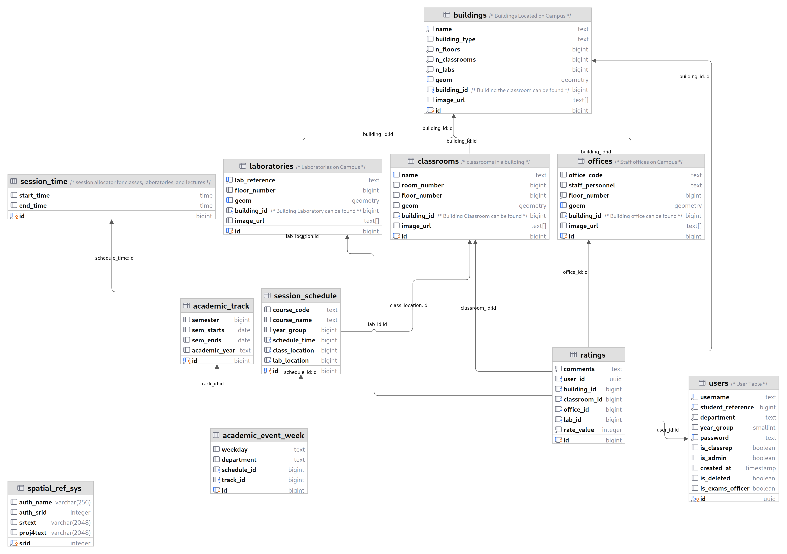

# Database Design

The database design and schema for the Compax web app are crucial components that define the structure and organization of data within the application. A well-designed database schema ensures efficient data storage, retrieval, and integrity. Below is an elaboration of the database design and schema for the Compax web app.

*****************************************************************************

## Entity-Relationship Diagram (ERD)

An Entity-Relationship Diagram (ERD) is a visual representation of the database schema, showing the entities (tables) and their relationships. The ERD for the Compax web app might include the following entities:



### Table Structure and Data Types

   The table structure for each entity in the database is defined by specifying the columns (attributes) and their corresponding data types. For example:

#### Users

This table stores information about the users of the system, including their username, student reference number, department, year group, password, and whether they are a class rep, admin, or exams officer.

    ```sql
    create table
    public.users (
        id uuid not null,
        username text not null,
        student_reference bigint not null,
        department text not null default ''::text,
        year_group smallint null,
        password text not null,
        is_classrep boolean null,
        is_admin boolean null,
        created_at timestamp without time zone null default (now() at time zone 'utc'::text),
        is_deleted boolean null,
        is_exams_officer boolean null,
        constraint users_pkey primary key (id),
        constraint users_password_key unique (password),
        constraint users_student_reference_key unique (student_reference),
        constraint users_username_key unique (username),
        constraint users_id_fkey foreign key (id) references auth.users (id),
        constraint users_year_group_check check (
        (
            (year_group < 7)
            and (year_group > 0)
        )
        )
    ) tablespace pg_default;
    ```

#### Geometry Tables

These tables store geometric data about the buildings, classrooms, and laboratories on campus. The buildings table stores information about the name, building type, number of floors, number of classrooms, and number of laboratories in each building. The classrooms table stores information about the name, room number, and floor number of each classroom. The laboratories table stores information about the lab reference, floor number, and building ID of each laboratory.

Buildings

    ```sql
    create table
    public.buildings (
        id bigint generated by default as identity,
        name text not null,
        building_type text null,
        n_floors bigint not null default '0'::bigint,
        n_classrooms bigint not null default '0'::bigint,
        n_labs bigint not null default '0'::bigint,
        geom geometry null,
        building_id bigint null,
        image_url text[] null,
        constraint buildings_pkey primary key (id),
        constraint buildings_geom_key unique (geom),
        constraint buildings_name_key unique (name),
        constraint buildings_building_id_fkey foreign key (building_id) references buildings (id) on delete cascade
    ) tablespace pg_default;
    ```

Classrooms
  
    ```sql
    create table
    public.classrooms (
        id bigint generated by default as identity,
        name text null,
        room_number bigint null,
        floor_number bigint null,
        geom geometry null,
        building_id bigint null,
        image_url text[] null,
        constraint classrooms_pkey primary key (id),
        constraint classrooms_name_key unique (name),
        constraint classrooms_building_id_fkey foreign key (building_id) references buildings (id) on delete cascade
    ) tablespace pg_default;
    ```

Laboratories

    ```sql
    create table
    public.laboratories (
        id bigint generated by default as identity,
        lab_reference text not null,
        floor_number bigint null default '0'::bigint,
        geom geometry null,
        building_id bigint null,
        image_url text[] null,
        constraint laboratories_pkey primary key (id),
        constraint laboratories_geom_key unique (geom),
        constraint laboratories_lab_reference_key unique (lab_reference),
        constraint laboratories_building_id_fkey foreign key (building_id) references buildings (id) on delete cascade
    ) tablespace pg_default;
    ```

Offices

#### Evaluation Tables

These tables store information about the ratings that users have given to different aspects of the university. The ratings table stores the rating, comment, and timestamp for each rating.

Ratings

    ```sql
    create table
    public.ratings (
        id bigint generated by default as identity,
        comments text not null default ''::text,
        building_id bigint null,
        classroom_id bigint null,
        office_id bigint null,
        lab_id bigint null,
        rate_value integer not null,
        constraint ratings_pkey primary key (id),
        constraint ratings_building_id_fkey foreign key (building_id) references buildings (id),
        constraint ratings_classroom_id_fkey foreign key (classroom_id) references classrooms (id),
        constraint ratings_lab_id_fkey foreign key (lab_id) references laboratories (id),
        constraint ratings_office_id_fkey foreign key (office_id) references offices (id),
        constraint ratings_rate_value_check check (
        (
            (rate_value < 6)
            and (rate_value > 0)
        )
        )
    ) tablespace pg_default;
    ```

#### Scheduling Tables

These tables store information about the academic events that take place on campus. The academic_event_week table stores information about the weekday, department, schedule ID, and track ID for each academic event week. The academic_track table stores information about the semester, semester start date, semester end date, and academic year for each academic track. The session_schedule table stores information about the course code, course name, year group, schedule time, class location, and lab location for each session schedule. The session_time table stores information about the start time and end time for each session time.

Academic Event Week

    ```sql
    create table
    public.academic_event_week (
        id bigint generated by default as identity,
        weekday text null,
        department text null,
        schedule_id bigint null,
        track_id bigint null,
        constraint academic_event_week_pkey primary key (id),
        constraint academic_event_week_schedule_id_fkey foreign key (schedule_id) references session_schedule (id),
        constraint academic_event_week_track_id_fkey foreign key (track_id) references academic_track (id)
    ) tablespace pg_default;
    ```

Academic Track

    ```sql
    create table
    public.academic_track (
        id bigint generated by default as identity,
        semester bigint null,
        semester_start date null,
        semester_end date null,
        academic_year text null,
        constraint academic_track_pkey primary key (id)
    ) tablespace pg_default;
    ```

Session Schedule

    ```sql
    create table
    public.session_schedule (
        id bigint generated by default as identity,
        course_code text null,
        course_name text null,
        year_group bigint null,
        schedule_time bigint null,
        class_location bigint null,
        lab_location bigint null,
        constraint session_schedule_pkey primary key (id),
        constraint session_schedule_class_location_fkey foreign key (class_location) references classrooms (id),
        constraint session_schedule_lab_location_fkey foreign key (lab_location) references laboratories (id),
        constraint session_schedule_schedule_time_fkey foreign key (schedule_time) references session_time (id) on delete cascade
    ) tablespace pg_default;
    ```

Session Time

    ```sql
    create table
    public.session_time (
        id bigint generated by default as identity,
        start_time time without time zone null,
        end_time time without time zone null,
        constraint session_time_pkey primary key (id)
    ) tablespace pg_default;
    ```

   The choice of data types for each column ensures that the database efficiently stores and retrieves the data, while also enforcing data integrity constraints.

## Normalization and Data Integrity

Database normalization is applied to ensure data integrity and to reduce data redundancy. The schema is organized into multiple tables, with each table focused on a specific entity. Relationships between entities are established using foreign keys, maintaining referential integrity.
